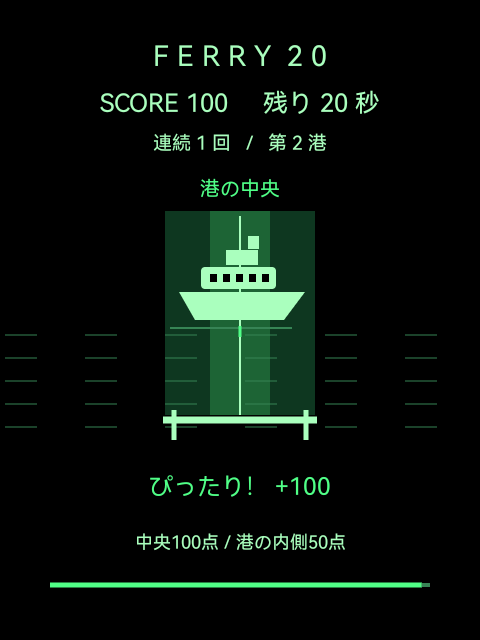
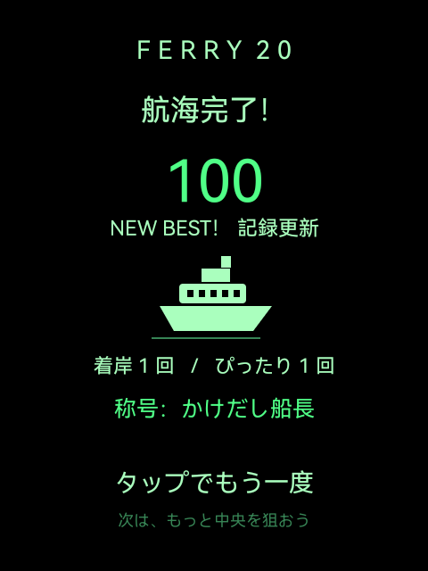

# FERRY 20

**タップひとつで、フェリーを港の中央へ。Rokid Glasses向けの20秒ゲームです。**

展示中に参加者からもらったテーマをきっかけに、GPT-6 Astraに5分での制作を依頼して生まれました。その場のアイデアを、グラスで遊べる体験にする試みです。その後、実機で見つかった入力の遅延や二重判定、音声処理を調整しました。

このリポジトリは、その調整を含む試作版です。「5分」は制作時に伝えた条件であり、現在の版の検証・改善までを含む総作業時間ではありません。

<p>
  
  
</p>

画面は2026年9月の実機検証時に取得したものです。検証用に状態を設定した画面を含み、表示スコアは参加者の実績を示すものではありません。グラス越しの見え方を撮影した写真ではありません。

## 遊び方

1. グラス側面をタップして出航します。
2. 左右に動くフェリーが港の中央に来たら、もう一度タップします。
3. 20秒間で何回着岸できるか挑戦します。結果画面からタップで再挑戦できます。

中央なら100点、港の内側なら50点。連続成功で追加点が増え、最大100点のボーナスが付きます。失敗すると連続ボーナスがリセットされます。最高得点は、その端末に保存されます。

頭の動きやスマートフォンの操作は使いません。ネット接続、アカウント登録、カメラ・マイクの権限は不要です。

## 制作と実機での改善

制作のきっかけは、展示の参加者から受け取ったテーマでした。企画とAIへの制作指示、実機での確認を往復しながら、短い時間で試せるゲームにしています。AIによる制作を紹介するとともに、手元の機材で検証して直した点も残します。

- **タップした瞬間に止める**：確認したRokidのタッチパッドは、接触信号の後にENTERを送ります。接触時に判定し、同じ操作から後で届くENTERは重複として扱います。
- **止まった場所を見せる**：判定後の650ミリ秒は船の位置を固定し、結果を読み取れるようにしました。
- **音で描画を待たせない**：音声の操作を専用スレッドに分けています。
- **中断から戻れるようにする**：アプリが背面に回った時間をゲーム進行から除外します。

[実装と確認範囲のメモ](docs/DEVELOPMENT.md) / [検証状況](docs/VERIFICATION.md)

## 対象端末と制約

- 過去の確認端末：Rokid RG_glasses、Android API 32、480×640。
- 他のRokid製品・ファームウェアでの動作は未確認です。
- ENTERなどの決定キーと画面タッチにも対応しています。Rokid向けの即時入力は、特定の入力デバイス名とスキャンコードを条件にします。
- 保存するのは最高得点です。プロセスの終了・再起動時に、プレイ途中の状態は復元しません。
- 装着時の操作感、見やすさ、スピーカーの聞こえ方は実機で確認してください。

## ビルドする

Windows向けのPowerShellスクリプトでAPKを作ります。GradleやRokid SDKは使いません。

必要なもの：

- PowerShell 7
- JDK（Android Studio付属のJBR、または`JAVA_HOME`で指定）
- Android SDK Platform 36、Build Tools 36.0.0
- 実機への導入・テストにはAndroid SDK Platform-Tools（ADB）

Android SDKを`ANDROID_HOME`または`ANDROID_SDK_ROOT`で、JDKを`JAVA_HOME`で指定できます。未指定の場合の標準Windowsパスと指定方法はビルドスクリプトを参照してください。

```powershell
pwsh -File .\build.ps1
```

成功すると`artifacts/ferry20-debug.apk`が生成されます。開発用署名鍵はローカルに生成し、Gitでは管理しません。アプリとテストAPKは同じ鍵を使います。

## 実機へ入れる

USBデバッグを有効にした端末を接続し、次の`YOUR_DEVICE_SERIAL`を`adb devices -l`に表示される端末IDに置き換えてください。以下は`adb`をPATHに追加した環境での例です。

```powershell
adb devices -l
adb -s YOUR_DEVICE_SERIAL install -r .\artifacts\ferry20-debug.apk
adb -s YOUR_DEVICE_SERIAL shell am start -n com.smartglasses.ferry20/.MainActivity
```

過去に別の署名鍵で作られた同じアプリが入っている場合、上書きインストールは失敗します。アンインストールすると端末内の最高得点も消えるため、スクリプトで自動削除は行いません。

## テスト

端末なしでアプリとテストAPKをビルドする場合：

```powershell
pwsh -File .\tests\build.ps1
```

実機で17項目のInstrumentationテストを実行する場合：

```powershell
pwsh -File .\tests\run.ps1 -DeviceSerial YOUR_DEVICE_SERIAL
```

実機テストはAPKを導入してアプリを操作します。テスト中は端末を触らず、結果の`TOTAL passed=17 failed=0`を確認してください。最高得点の退避・復元処理がありますが、接続断などで中断した場合は確認が必要です。Rokid固有入力のテストを含むため、一般的なAndroidエミュレーターだけで全項目を検証する構成ではありません。

現在の確認結果と過去の記録は[検証状況](docs/VERIFICATION.md)に分けて記載しています。

## 構成

```text
app/src/main/      ゲーム・Androidリソース
tests/            実機テストと実行スクリプト
scripts/          共通のビルド処理・SDKとJDKの検出
docs/             実装メモ・確認結果・画面画像
build.ps1         APKのビルド
```

ゲームはJavaのActivityと独自Viewで実装しています。画面はCanvasで描き、BGMと5種類の効果音はPCM合成とAudioTrackで鳴らします。実行時に生成AIのAPIは使いません。

## 作者・クレジット

企画・制作指示・実機確認：鮫🦈さめでぃれくたー / [aym-same](https://github.com/aym-same)

初期制作に使用したAI：GPT-6 Astra。公開準備ではビルド手順・文書・検証状況を整えています。

[プロフィール・活動リンク](https://aym-same.github.io/aymsmsm_link/) / [X](https://x.com/aym_same)

## 利用条件

[MIT License](LICENSE)で公開しています。利用・改変・再配布の際は、著作権表示とライセンス表示を残してください。
